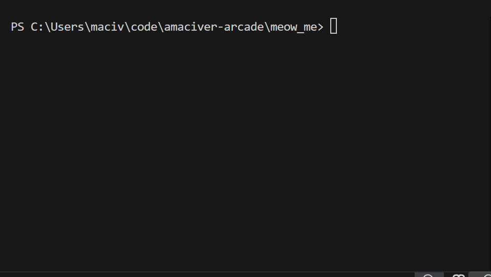
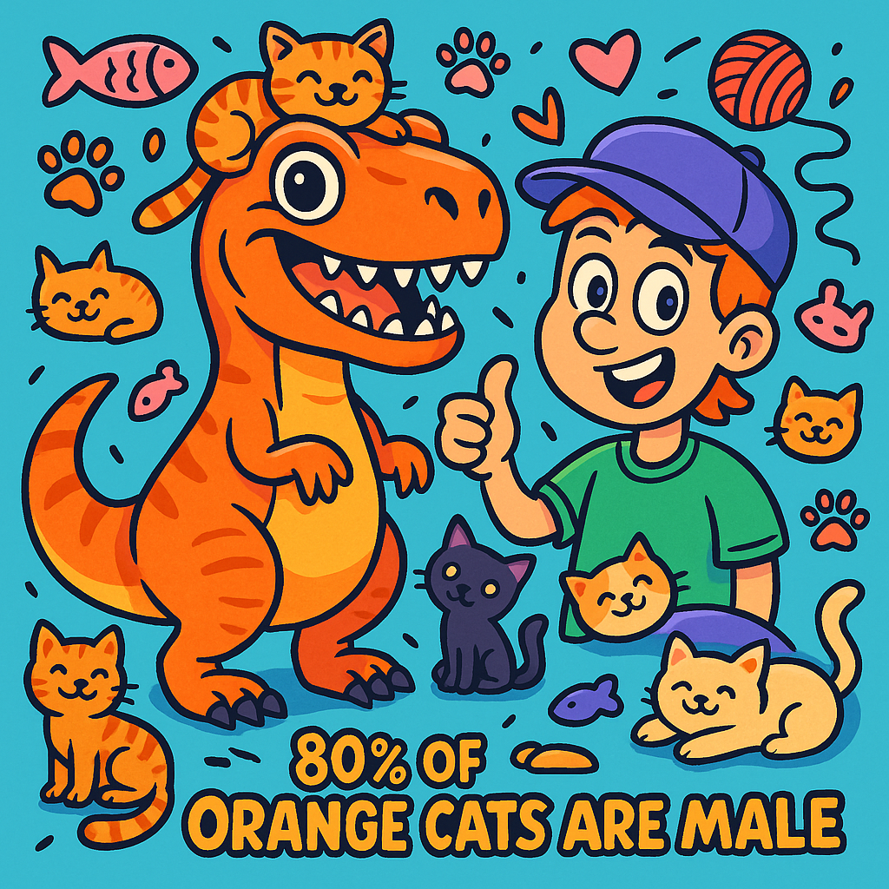
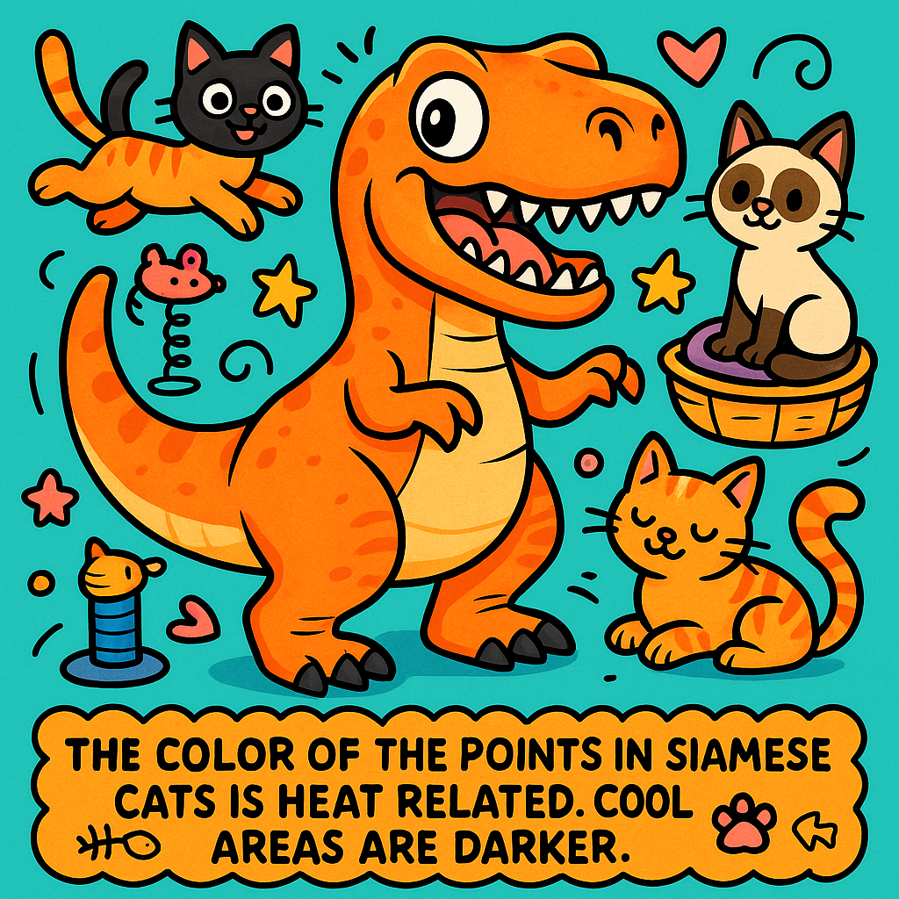
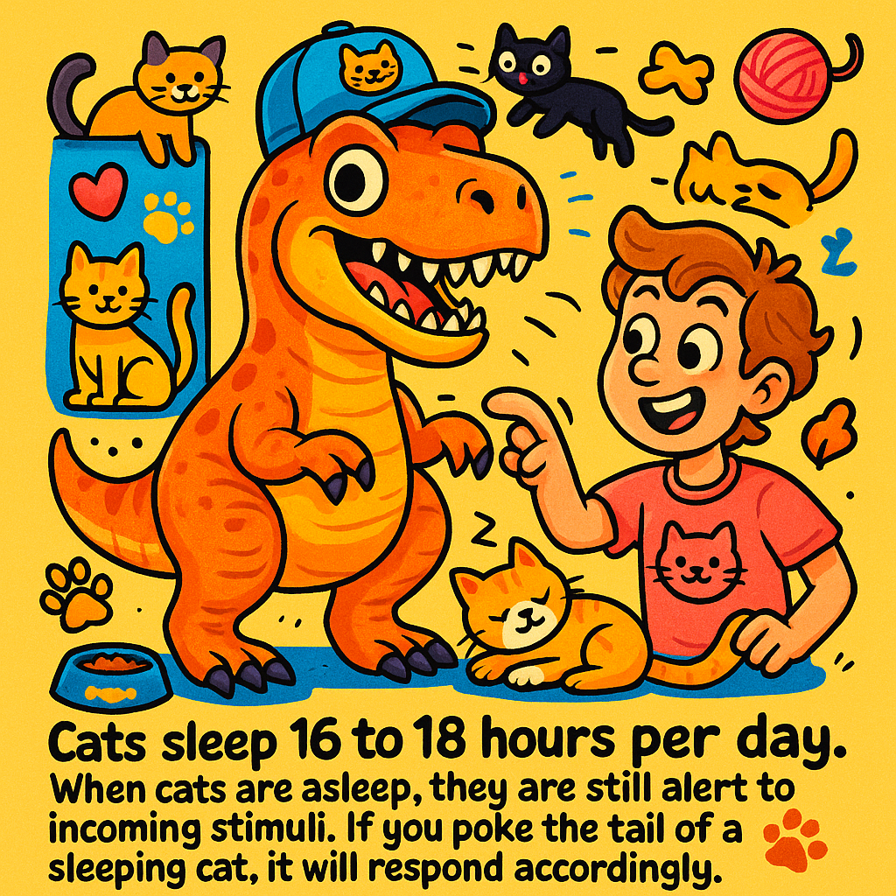

# Meow Art (meow_me)

**Cat-fact-inspired art agent** - an MCP server + LLM-powered CLI agent built with [Arcade.dev](https://arcade.dev) and [OpenAI](https://openai.com).

Meow Art fetches random cat facts, retrieves your Slack avatar, generates stylized cat-themed images using OpenAI's gpt-image-1, and sends the results to Slack. It exposes 7 MCP tools deployed to Arcade Cloud, and includes a thin interactive agent powered by the OpenAI Agents SDK that calls these tools remotely via the Arcade SDK — enforcing complete separation of concerns between the agent (LLM client) and the tools (deployed MCP server).

---

## Quick Start

### Prerequisites

- Python 3.10+
- [uv](https://docs.astral.sh/uv/)
- [Arcade CLI](https://docs.arcade.dev) (`uv tool install arcade-mcp`)

### 1. Clone and install

```bash
git clone https://github.com/amaciver/amaciver-arcade.git
cd amaciver-arcade/meow_me
uv sync --all-extras
```

### 2. Try the demo (no API keys needed)

```bash
uv run python -m meow_me --demo
```

Walks through 4 scripted scenarios showing exactly what the agent does: one-shot "meow me", fact browsing with text delivery, image pipeline, and browse-only mode.

### 3. Run evaluations (tests LLM tool selection)

```bash
# Set your API key
export OPENAI_API_KEY=sk-...

# Run all 12 evaluation cases
uv run arcade evals evals/

# With detailed output
uv run arcade evals evals/ --details
```

See [evals/README.md](evals/README.md) for full documentation. Evaluations test whether AI models correctly select and invoke tools (complementing the 128 pytest unit tests).

### 4. Run the interactive agent

```bash
# Create .env with your keys (see .env.example)
cat > .env <<EOF
OPENAI_API_KEY=sk-...
# Option A: Direct Slack bot token (all features incl. image upload)
SLACK_BOT_TOKEN=xoxb-...
# Option B: Arcade OAuth (text messaging + avatars, no image upload)
ARCADE_API_KEY=arc-...
ARCADE_USER_ID=your-email@example.com
EOF

# Start the agent (Arcade OAuth)
# - Text + avatars work, images saved locally (file path shown + ASCII preview)
uv run python -m meow_me

# Or with direct Slack bot token (--slack flag)
# - Full Slack integration: uploads images directly to channels
uv run python -m meow_me --slack
```

**Examples:**


*Default mode: Images saved locally with ASCII preview*


*--slack mode: Direct channel image uploads*

> **`--slack` mode:** At startup, the agent prompts for your Slack username or display name and looks you up in the workspace. This is needed because a bot token's `auth.test` returns the bot's identity, not yours. The resolved user is cached for the session.

The agent uses `gpt-4o-mini` to reason about which tools to call based on your input. All tools run remotely on Arcade Cloud — the agent is a thin LLM client with no tool logic. Try:
- `"Meow me!"` - one-shot: fetches fact + avatar + generates image + DMs you
- `"Give me 3 cat facts"` - browse facts, pick one, choose image or text, choose where to send
- `"Make me cat art"` - fetches a fact, generates cat-themed art from your avatar

### 5. Connect as MCP server

**Option A: Claude Desktop**

Add to your Claude Desktop config (`%APPDATA%\Claude\claude_desktop_config.json`):

> **Windows Store install?** Config is at `%LOCALAPPDATA%\Packages\Claude_<id>\LocalCache\Roaming\Claude\claude_desktop_config.json`

```json
{
  "mcpServers": {
    "meow-me": {
      "command": "uv",
      "args": ["run", "--directory", "/path/to/amaciver-arcade/meow_me", "arcade", "mcp", "-p", "meow_me", "stdio"],
      "env": {
        "PYTHONIOENCODING": "utf-8",
        "OPENAI_API_KEY": "sk-..."
      }
    }
  }
}
```

> **Image generation in Claude Desktop** requires `OPENAI_API_KEY` in the env config above. Without it, `generate_cat_image` returns an error message instead of an image. The generated image preview is returned as MCP `ImageContent` (compressed JPEG thumbnail) and appears in Claude Desktop's tool results.

Restart Claude Desktop, then ask: *"Meow me!"* or *"Send a cat fact to #random"*

> **Note:** On Windows, use the absolute path to `uv.exe` if it isn't on the system PATH.

**Option B: HTTP transport (Cursor, VS Code, etc.)**

```bash
uv run arcade mcp -p meow_me http --debug
```

Server starts at `http://127.0.0.1:8000`.

### 6. Run tests

**Unit tests (pytest)** - test implementation correctness:

```bash
uv run pytest -v
```

Tests cover:

```
tests/test_facts.py   - Fact parsing & fetching
tests/test_slack.py   - Messaging, file upload, channel resolution, token fallback
tests/test_avatar.py  - Slack avatar extraction & fallbacks, token fallback
tests/test_image.py   - Prompts, validation, thumbnail, ImageContent patch, save_image_locally
tests/test_agent.py   - System prompt, demo, Arcade SDK integration, capabilities, user resolution
tests/test_evals.py   - End-to-end evaluation scenarios
```

**Evaluations (Arcade evals)** - test LLM tool selection:

```bash
# Requires OPENAI_API_KEY
uv run arcade evals evals/
```

12 evaluation cases across 2 suites (all passing!). See [evals/README.md](evals/README.md) for details.

---

## Example Output

Here are some images generated by the `generate_cat_image` tool, transforming a Slack avatar into cat-themed art:

| | |
|---|---|
|  |  |
| *"80% of orange cats are male"* | *"The color of the points in Siamese cats is heat related. Cool areas are darker."* |
|  | |
| *"Cats sleep 16 to 18 hours per day"* | |

Each image is generated by `gpt-image-1` using your Slack avatar as the input image, combined with a cat fact and an art style (cartoon, watercolor, anime, or photorealistic).

---

## Architecture

```
┌─────────────────────────────────┐
│       Interactive Agent          │
│    (OpenAI Agents SDK)           │
│    gpt-4o-mini                   │
│                                  │
│  ┌─ NO tool logic here ──────┐  │
│  │ Agent is a thin LLM client│  │
│  │ LLM decides which tools   │  │
│  │ to call based on user     │  │
│  │ input + system prompt     │  │
│  └───────────────────────────┘  │
└───────────────┬─────────────────┘
                │ Arcade SDK (arcadepy + agents-arcade)
                │ get_arcade_tools() → remote tool execution
                ▼
┌────────────────────────────────────────────────────────────────────────┐
│                    Arcade Cloud (deployed tools)                       │
│                    arcade deploy -e server.py                          │
├────────────────────────────────────────────────────────────────────────┤
│                                                                        │
│  MeowMe_GetCatFact       (no auth)                                    │
│    └── MeowFacts API → random cat facts                                │
│                                                                        │
│  MeowMe_GetUserAvatar    (Slack OAuth: users:read)                    │
│    ├── auth.test → get your user ID                                    │
│    └── users.info → avatar URL + display name                          │
│                                                                        │
│  MeowMe_GenerateCatImage (requires_secrets: OPENAI_API_KEY)           │
│    ├── Download avatar from URL                                        │
│    ├── Compose style prompt + cat fact                                  │
│    ├── OpenAI gpt-image-1 images.edit → 1024x1024 PNG                  │
│    ├── Stash full-res PNG server-side (for send_cat_image)             │
│    └── Compress JPEG thumbnail for MCP ImageContent preview            │
│                                                                        │
│  MeowMe_MeowMe          (Slack OAuth: chat:write, im:write,           │
│    ├── auth.test → get user ID   users:read + OPENAI_API_KEY)         │
│    ├── conversations.open → open DM                                    │
│    ├── MeowFacts → fetch a fact                                        │
│    ├── users.info → get avatar URL                                     │
│    ├── gpt-image-1 → generate cat art (fallback: text-only)            │
│    └── files.upload → DM image + caption                               │
│                                                                        │
│  MeowMe_SendCatFact     (Slack OAuth: chat:write)                     │
│    ├── MeowFacts → fetch N facts                                       │
│    └── chat.postMessage → send to channel                              │
│                                                                        │
│  MeowMe_SendCatImage    (Slack OAuth: chat:write, files:write)        │
│    ├── Resolve channel name → ID                                       │
│    ├── files.getUploadURLExternal → get upload URL                     │
│    └── files.completeUploadExternal → share to channel                 │
│                                                                        │
│  MeowMe_SaveImageLocally (no auth)                                    │
│    └── Save generated image to local file                              │
│                                                                        │
└────────────────────────────────────────────────────────────────────────┘
                                     │ Also accessible via MCP Protocol
                        ┌────────────▼────────────┐
                        │       MCP Clients        │
                        │ Claude Desktop | Cursor  │
                        └─────────────────────────┘

Key Separation:
  • Agent (agent.py) has ZERO imports from meow_me.tools.*
  • All tool calls go through AsyncArcade → Arcade Cloud → deployed MCP server
  • Auth handled entirely by Arcade platform (OAuth flow managed server-side)
  • --slack mode: SLACK_BOT_TOKEN passed as env var to deployed tools
```

---

## Agent Interaction Model

The agent has two modes of behavior:

### 1. "Meow me" (one-shot, no prompts)

Standalone trigger fires the full pipeline automatically:

```
User: "Meow me!"
Agent: → meow_me()
       Internally: fact + avatar + image gen + DM self. No questions asked.
```

Any modifier breaks it into interactive mode: `"Meow me to #random"`, `"Meow me in watercolor"`, `"Meow me 3 facts"`.

### 2. Everything else (two-phase interactive flow)

```
Phase 1 — Fact Selection
  Agent fetches fact(s), presents them, lets you rotate until happy.

Phase 2 — Delivery Options
  Agent asks: "With image or just text?"
  → Text only: asks where to send → send_cat_fact(channel)
  → With image: get_user_avatar → generate_cat_image → asks where → send_cat_image(channel)
  → Display only: shows fact/image in chat, no Slack send
```

### Agent-Tool Separation

The agent (`agent.py`) contains **zero tool logic** — it's a thin LLM client that:
1. Connects to Arcade-deployed tools via `get_arcade_tools()`
2. Creates an `Agent` with the discovered tools
3. Runs `Runner.run()` in an interactive loop

All tool implementations live in the MCP server (`tools/*.py`), deployed to Arcade Cloud. The agent never imports from `meow_me.tools` — complete process and network isolation.

---

## MCP Tools (7 deployed tools)

| Tool (MCP name) | Auth | Description |
|------|------|-------------|
| `MeowMe_GetCatFact` | None | Fetch 1-5 random cat facts from MeowFacts API |
| `MeowMe_GetUserAvatar` | Slack OAuth (`users:read`) | Get your Slack avatar URL and display name |
| `MeowMe_GenerateCatImage` | `requires_secrets: OPENAI_API_KEY` | Transform avatar into cat-themed art via gpt-image-1 |
| `MeowMe_MeowMe` | Slack OAuth (full scopes) + `requires_secrets: OPENAI_API_KEY` | One-shot: fact + avatar + image + DM self |
| `MeowMe_SendCatFact` | Slack OAuth (`chat:write`) | Send 1-3 text cat facts to a channel |
| `MeowMe_SendCatImage` | Slack OAuth (`chat:write`, `files:write`) | Upload image + caption to a channel |
| `MeowMe_SaveImageLocally` | None | Save generated image to local file |

---

## Environment Variables

```bash
# .env (gitignored) — see src/meow_me/.env.example
OPENAI_API_KEY=sk-...          # For agent LLM (gpt-4o-mini) AND image generation (gpt-image-1)
SLACK_BOT_TOKEN=xoxb-...       # Optional: direct Slack auth (requires --slack flag to activate)
ARCADE_API_KEY=arc-...         # Required: connects agent to Arcade-deployed tools
ARCADE_USER_ID=you@email.com   # Optional: skip the email prompt during Arcade OAuth
```

### Slack Auth

**Default mode:** Auth is fully managed by the Arcade platform. When tools need Slack access, Arcade handles the OAuth flow (browser-based). The agent never touches tokens directly.

**`--slack` mode** (explicit opt-in): `SLACK_BOT_TOKEN` is passed as an environment variable to the deployed tools. MCP tools fall back to this env var when the Arcade OAuth context token is empty, enabling `files:write` scope for image uploads.

> **User resolution in `--slack` mode:** A bot token's `auth.test` returns the bot's identity, not yours. At startup, the agent prompts for your Slack username, looks you up via `users.list`, and caches your user ID for the session.

---

## Known Limitations

- **Arcade Cloud worker timeout**: Arcade Cloud has an internal worker timeout (~30 seconds). `gpt-image-1` image generation takes 30-60 seconds, exceeding this limit. `GenerateCatImage` and `MeowMe` (which includes image generation) time out when called via Arcade Cloud. All other tools work correctly on Arcade Cloud. Image generation works fully when running locally via `arcade mcp -p meow_me stdio`. The agent handles timeout errors gracefully, falling back to text-only delivery. This is a platform constraint, not a code bug — the architecture demonstrates complete agent-tool separation regardless.
- **Pre-refactor baseline**: Commit `7a88607` is the last fully-working monolithic version where the agent and tools ran in the same process. All features worked end-to-end (138 tests, image generation, Slack upload). The refactor to Arcade Cloud deployment (this version) prioritizes architectural separation over end-to-end image generation on the cloud.
- **Arcade OAuth + image upload**: Arcade's Slack provider does not support the `files:write` scope. When using Arcade OAuth (instead of a direct `SLACK_BOT_TOKEN`), the `send_cat_image` tool and image upload in `meow_me` are unavailable. The agent falls back to: generate image → save locally (outputs file path like `meow_art_20260216_140523.png`) → show ASCII preview in terminal → send text-only fact to DM.
- **Image generation time**: `gpt-image-1` takes 30-60 seconds per image. The agent shows a progress indicator while generating.
- **`send_cat_image` requires `SLACK_BOT_TOKEN`**: Since Arcade OAuth can't grant `files:write`, image uploads to Slack channels only work with a direct bot token.
- **Claude Desktop image preview**: Generated images appear in Claude Desktop's tool results (as compressed JPEG thumbnails via MCP `ImageContent`), but are not displayed inline in the conversation. The full-res PNG is stored server-side and can be sent to Slack via `send_cat_image`.
- **arcade-mcp-server ImageContent**: Arcade `@tool` functions must return dicts (per their typed schemas). The framework's `convert_to_mcp_content()` converts these dicts to MCP content blocks, but by default only emits `TextContent`. We monkey-patch it at import time in `__init__.py` to detect a special `_mcp_image` key and also emit `ImageContent` blocks, enabling inline image previews in Claude Desktop.

---

## Project Structure

```
meow_me/
├── src/meow_me/
│   ├── __init__.py        # load_dotenv, debug logging, ImageContent monkey-patch
│   ├── server.py          # MCPApp entry point (registers all tool modules)
│   ├── agent.py           # Thin LLM agent (calls tools via Arcade SDK, no tool logic)
│   ├── __main__.py        # python -m meow_me support
│   └── tools/
│       ├── facts.py       # MeowFacts API (get_cat_fact, no auth)
│       ├── avatar.py      # Slack avatar retrieval (get_user_avatar)
│       ├── image.py       # OpenAI image generation + thumbnail + server-side stash + save_image_locally
│       └── slack.py       # Slack messaging + file upload (meow_me, send_cat_fact, send_cat_image)
├── examples/
│   ├── orange_cats.png    # "80% of orange cats are male"
│   ├── siamese_cats.png   # "The color of the points in Siamese cats is heat related..."
│   └── sleeping_cats.png  # "Cats sleep 16 to 18 hours per day"
├── tests/
│   ├── test_facts.py      # Fact parsing & fetching (11 tests)
│   ├── test_avatar.py     # Slack avatar extraction & fallbacks (13 tests)
│   ├── test_image.py      # Prompts, validation, thumbnail, ImageContent patch, save_image_locally (31 tests)
│   ├── test_slack.py      # Messaging, file upload, channel resolution, bot membership (34 tests)
│   ├── test_agent.py      # System prompt, demo, Arcade SDK integration, capabilities, user resolution (31 tests)
│   └── test_evals.py      # End-to-end evaluation scenarios (8 tests)
├── pyproject.toml
└── .env                   # API keys (gitignored)
```

---

## Slack OAuth Setup

The MCP server tools use Arcade's **built-in Slack OAuth provider** - no manual app creation needed.

1. Run `arcade login` to authenticate with the Arcade platform
2. When an MCP client calls a Slack tool, Arcade handles the OAuth flow
3. The user authenticates via browser, and Arcade injects the token at runtime

### Required Slack Scopes

| Scope | Used by | Arcade OAuth? |
|-------|---------|---------------|
| `chat:write` | `meow_me`, `send_cat_fact`, `send_cat_image` - post messages | Supported |
| `im:write` | `meow_me` - open DM conversation via `conversations.open` | Supported |
| `users:read` | `meow_me`, `get_user_avatar` - retrieve avatar via `users.info` | Supported |
| `files:write` | Image upload via Slack file upload API (not requested by MCP tools) | **NOT supported** by Arcade |
| `channels:read` | `send_cat_image` - resolve channel names to IDs for file uploads | N/A (bot token only) |
| `channels:join` | `send_cat_image` - ensure bot is in the target channel before upload | N/A (bot token only) |

> **Note:** The MCP tools no longer request `files:write` in their OAuth scopes since Arcade doesn't support it. Image upload is attempted at runtime and falls back to text-only if the token lacks `files:write`. For full image upload support, use a direct `SLACK_BOT_TOKEN` with all the scopes above.

---

## Key Design Decisions

| Decision | Choice | Rationale |
|----------|--------|-----------|
| Agent framework | OpenAI Agents SDK + agents-arcade | Arcade's official integration; tools discovered via `get_arcade_tools()` |
| Agent-tool separation | Arcade SDK (remote calls) | Agent has zero imports from tool modules; complete process/network isolation |
| Agent LLM | gpt-4o-mini | Fast, cheap, sufficient for tool routing |
| Image generation | OpenAI gpt-image-1 (`images.edit`) | Same API key as agent LLM; accepts avatar as input image |
| Async image gen | `asyncio.to_thread()` | gpt-image-1 uses sync `OpenAI()` client; thread avoids blocking the event loop |
| Image delivery | Slack file upload API (`getUploadURLExternal` flow) | Modern Slack file sharing; `files.upload` is deprecated |
| Arcade OAuth fallback | Text DM + local save + ASCII preview | Graceful degradation when `files:write` is unavailable |
| ASCII art preview | Pillow grayscale → character mapping | Immediate visual feedback in terminal without needing an image viewer |
| Tool deployment | `arcade deploy -e server.py --secrets all` | Tools run on Arcade Cloud; agent connects via SDK |
| Cloud secrets | `requires_secrets=["OPENAI_API_KEY"]` on `@tool` | Arcade Engine injects secrets into context; `os.getenv()` doesn't work on cloud |
| Dual Slack auth modes | `--slack` flag (bot token) or default (Arcade OAuth) | Full Slack features with bot token; graceful degradation with Arcade OAuth |
| Fallback behavior | Text-only when OPENAI_API_KEY missing | Full pipeline still completes; placeholder PNG for `generate_cat_image` |
| Avatar input | BytesIO with `.name = "avatar.png"` | OpenAI SDK needs named file-like object for MIME type detection |
| External API | MeowFacts | Free, no auth, structured JSON |
| Slack auth (MCP) | Arcade built-in Slack provider | Zero setup - demonstrates Arcade's core OAuth value |
| Count limits | get_cat_fact: 1-5, send_cat_fact: 1-3 | Prevent spam while allowing batch sends |
| Server-side image stash | `_last_generated_image` dict | Avoids sending ~2MB base64 through LLM context; tools reference via `"__last__"` |
| Thumbnail compression | 512x512 JPEG at 80% quality | Claude Desktop has ~1MB MCP content limit; thumbnail is ~50-100KB |
| ImageContent monkey-patch | Patch `convert_to_mcp_content` | Arcade tools must return dicts; patch extends framework to emit ImageContent from dict values |
| `__init__.py` initialization | `load_dotenv()` + patch in `__init__.py` | `arcade mcp` never executes `server.py`; `__init__.py` runs for any import |
| Input validation | Error messages reference prerequisite tools | Guides the LLM to call `get_user_avatar`/`get_cat_fact` before `generate_cat_image` |

> **MCP Tools vs Resources for Images:** We use **tools** (not resources) because our use case requires LLM-controlled orchestration, inline previews, and single-operation generation. Resources would require URI-based retrieval and fit better for pre-existing image galleries. See [DEVELOPMENT_NOTES.md](DEVELOPMENT_NOTES.md#mcp-architecture-tools-vs-resources-for-images) for full comparison. **2026 Update:** [MCP Apps](http://blog.modelcontextprotocol.io/posts/2026-01-26-mcp-apps/) now enable tools to return interactive UI components beyond static images.

---

## Built With

- [Arcade MCP Server](https://docs.arcade.dev) - MCP server framework with OAuth
- [Arcade Python SDK (arcadepy)](https://github.com/ArcadeAI/arcade-py) - Remote tool execution via Arcade Cloud
- [agents-arcade](https://github.com/ArcadeAI/openai-agents-arcade) - Arcade ↔ OpenAI Agents bridge
- [OpenAI Agents SDK](https://github.com/openai/openai-agents-python) - Agent framework
- [OpenAI gpt-image-1](https://platform.openai.com/docs/guides/image-generation) - Image-to-image generation
- [Pillow](https://python-pillow.org/) - Image processing (ASCII art preview + thumbnail compression)
- [MeowFacts API](https://meowfacts.herokuapp.com/) - Random cat facts
- [httpx](https://www.python-httpx.org/) - Async HTTP client
- [uv](https://docs.astral.sh/uv/) - Python package management
- [Claude Code](https://claude.com/claude-code) - AI-assisted development (Claude Opus 4.6)
